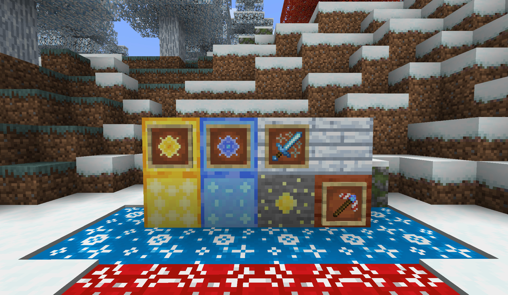
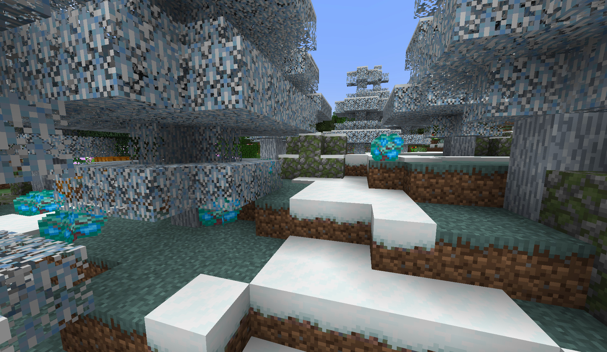
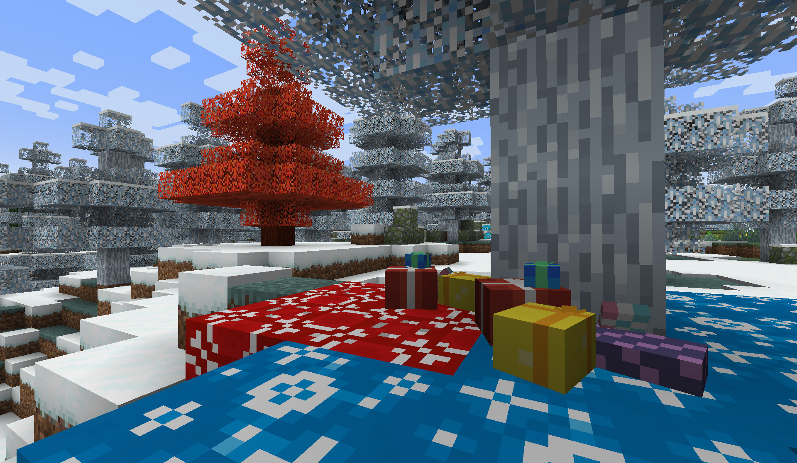

## Dependencies
- Fabric API
- Terrablender

## Description
"A Christmas Tale" is a Fabric mod themed around Christmas and all the magic that surrounds it.

## Caracteristics
- **New core item** : Stellar Heart, an item that contain the spirit of Christmas.
- **New items** : Food, items, weapons and more!
- **French & English langage support**

## Version
- This mod is compatible from 1.21 to 1.21.1, please check release page for more information.

## Bug Issues
If you encounter bugs or crash please open an issue on the repository.

## Screenshots

## Thanks & Contributions
If you think something should be improved don't hesitate to send me a message on my socials !

## Socials
[Bluesky](https://bsky.app/profile/sweetskylia.bsky.social)
